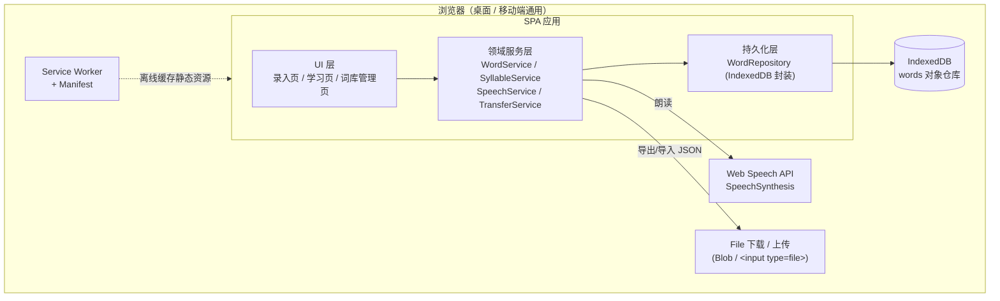
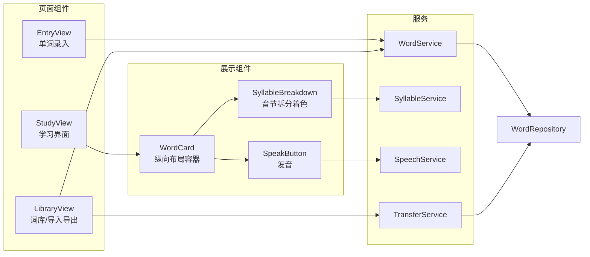
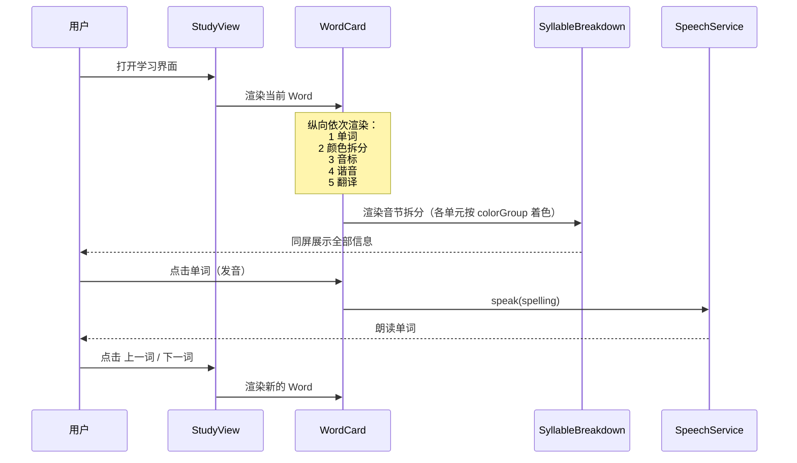
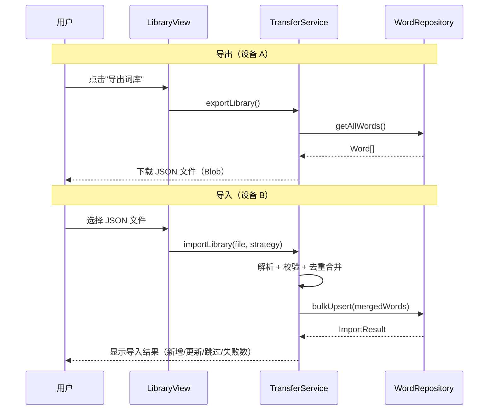
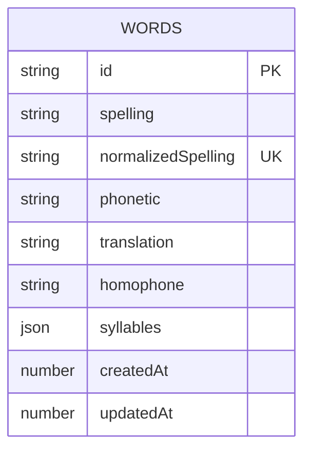

# 设计文档：english-learning-app（英语单词学习 PWA）

## Overview

（概述）

`english-learning-app` 是一个**纯前端渐进式 Web 应用（PWA）**，帮助用户录入单词、学习单词发音并管理个人词库。应用通过同一套代码同时运行于桌面与移动端浏览器，所有数据保存在浏览器本地的 **IndexedDB** 中，无后端服务器。跨设备的词库迁移通过 **JSON 文件导出 / 导入** 完成（前期不做云同步）。

核心学习能力包括：在同一个学习页面中**从上到下依次完整展示**——单词本身、按读音拆分并用不同颜色高亮的音节、标准音标（IPA）、中文谐音、中文翻译，以及使用浏览器内置 **Web Speech API（`SpeechSynthesisUtterance`）** 免费朗读单词（点击单词触发）。所有信息固定同屏呈现，无需切换模式。

设计目标是**最低成本、最简实现、桌面与移动端通用**。技术栈推荐 **轻量级框架（Svelte / Vue / React）+ Vite**，配合 **Service Worker + Web App Manifest** 实现可安装与离线使用。本文档中代码示例以 TypeScript/JavaScript 表达，伪代码用于描述与框架无关的核心算法。

---

## Architecture

（架构）

### 系统总体架构

应用是单页应用（SPA），分为 UI 层、领域逻辑层（services）和持久化层（IndexedDB）。Service Worker 拦截网络请求实现离线缓存。



### 组件关系图



### 学习界面渲染与交互流程（序列图）



### 学习页面布局（StudyView / WordCard）

学习页采用**固定纵向布局**，所有信息同屏依次呈现，从上到下顺序为：

```
┌─────────────────────────────┐
│   1. 单词（大字号，点击可发音） │  ← banana
│─────────────────────────────│
│   2. 颜色拆分（各音节不同色）   │  ← ba·na·na（三段不同颜色）
│─────────────────────────────│
│   3. 音标（IPA）              │  ← /bəˈnɑːnə/
│─────────────────────────────│
│   4. 谐音（中文辅助记忆）       │  ← 拔那那
│─────────────────────────────│
│   5. 翻译（中文释义）          │  ← 香蕉
└─────────────────────────────┘
        ◀ 上一词    下一词 ▶
```

布局规则：
- 五个区块始终全部显示，无模式切换、无"点击展开拆分"的交互。
- 单词区块为可点击热区，点击即调用 `SpeechService.speak` 朗读。
- 若某字段为空（如尚未填写谐音/翻译），对应区块显示占位提示（如"—"），不破坏布局结构。
- 颜色拆分区块直接按 `colorGroup` 为各音节上色，单元之间以分隔符（如 `·`）区分。




---

## Data Models

（数据模型）

### Word 实体

单词是核心实体。`id` 使用规范化拼写派生（或 UUID + 唯一拼写索引），用于跨设备去重。

```typescript
/** 读音单元（一个音节或读音片段） */
interface SyllableUnit {
  /** 该单元对应的字母片段，例如 "ba" */
  text: string;
  /** 该单元对应的音标片段（可选），例如 "bə" */
  phoneme?: string;
  /** 配色分组索引（0..N）。用于决定高亮颜色，相邻单元颜色不同 */
  colorGroup: number;
}

/** 单词实体 */
interface Word {
  /** 唯一 ID，跨设备稳定（基于规范化拼写） */
  id: string;
  /** 拼写（原始大小写保留用于展示） */
  spelling: string;
  /** 规范化拼写（小写、去首尾空格），用于去重与索引 */
  normalizedSpelling: string;
  /** 标准音标 IPA，例如 "/ˈbænənə/" */
  phonetic: string;
  /** 中文翻译 */
  translation: string;
  /** 中文谐音（辅助记忆发音），例如 "拔那那" */
  homophone: string;
  /** 按读音拆分的单元序列；空数组表示尚未拆分 */
  syllables: SyllableUnit[];
  /** 创建时间（epoch 毫秒） */
  createdAt: number;
  /** 最后更新时间（epoch 毫秒），用于导入合并时择新 */
  updatedAt: number;
}
```

**校验规则**：
- `spelling` 去除首尾空格后必须非空。
- `normalizedSpelling = spelling.trim().toLowerCase()`，且全库唯一。
- `phonetic` / `translation` / `homophone` 可为空字符串（允许先录入拼写、后补充）。
- `syllables` 中每个单元 `text` 非空；`colorGroup >= 0`。
- `createdAt <= updatedAt`。

### 学习页导航状态（UI 状态，非持久化）

学习页固定同屏展示全部字段，因此不存在"展示模式"或"拆分前/后"开关。组件本地仅需维护当前学习到第几个单词：

```typescript
/** 学习页的瞬时 UI 状态 */
interface StudyViewState {
  /** 当前单词在词库列表中的索引 */
  currentIndex: number;         // 默认 0
}
```

### 导入导出文件格式

```typescript
/** 导出文件顶层结构 */
interface LibraryExport {
  /** 格式版本，便于未来兼容升级 */
  schemaVersion: 1;
  /** 应用标识 */
  app: "english-learning-app";
  /** 导出时间（epoch 毫秒） */
  exportedAt: number;
  /** 单词列表 */
  words: Word[];
}

/** 导入合并策略 */
type MergeStrategy =
  | "keepNewer"   // 默认：按 updatedAt 取较新者
  | "keepLocal"   // 冲突时保留本地
  | "keepImported"; // 冲突时采用导入

/** 导入结果统计 */
interface ImportResult {
  added: number;    // 新增
  updated: number;  // 更新（已存在且被覆盖）
  skipped: number;  // 跳过（已存在但未变更/策略保留本地）
  failed: number;   // 校验失败
  errors: string[]; // 失败明细
}
```

### IndexedDB 结构

- 数据库名：`english-learning-app`
- 对象仓库：`words`，`keyPath: "id"`
- 索引：`by_normalizedSpelling`（unique）、`by_updatedAt`



---

## Components and Interfaces

（组件与接口 / 底层设计）

本节给出各服务与组件的函数签名和关键算法伪代码。代码以 TypeScript 表达，与具体框架无关。

### WordRepository（IndexedDB 持久化封装）

```typescript
interface WordRepository {
  open(): Promise<void>;                                  // 打开/升级数据库
  get(id: string): Promise<Word | undefined>;
  getByNormalizedSpelling(ns: string): Promise<Word | undefined>;
  getAll(): Promise<Word[]>;
  put(word: Word): Promise<void>;                         // 新增或覆盖
  bulkUpsert(words: Word[]): Promise<void>;               // 单事务批量写入
  delete(id: string): Promise<void>;
  count(): Promise<number>;
}
```

数据库初始化（`onupgradeneeded`）：创建 `words` 仓库（`keyPath: "id"`），建立唯一索引 `by_normalizedSpelling` 与普通索引 `by_updatedAt`。

### WordService（单词业务逻辑）

```typescript
interface NewWordInput {
  spelling: string;
  phonetic?: string;
  translation?: string;
  homophone?: string;
  syllables?: SyllableUnit[];
}

interface WordService {
  addWord(input: NewWordInput): Promise<Word>;      // 校验+规范化+查重后写入
  updateWord(id: string, patch: Partial<NewWordInput>): Promise<Word>;
  deleteWord(id: string): Promise<void>;
  getWord(id: string): Promise<Word | undefined>;
  listWords(): Promise<Word[]>;                     // 按 createdAt 排序
}
```

`addWord` 关键逻辑（伪代码）：

```
function addWord(input):
    spelling = input.spelling.trim()
    assert spelling != ""                       # 校验：拼写非空
    ns = spelling.toLowerCase()
    existing = repo.getByNormalizedSpelling(ns)
    if existing != null:
        throw DuplicateWordError(spelling)       # 已存在，交由 UI 提示是否改为更新
    now = Date.now()
    word = {
        id: ns,                                  # 以规范化拼写作为稳定 ID，便于跨设备去重
        spelling, normalizedSpelling: ns,
        phonetic: input.phonetic ?? "",
        translation: input.translation ?? "",
        homophone: input.homophone ?? "",
        syllables: input.syllables ?? [],
        createdAt: now, updatedAt: now
    }
    repo.put(word)
    return word
```

### SyllableService（按读音拆分与配色）

负责把单词拆分为读音单元，并为每个单元分配 `colorGroup`，保证相邻单元颜色不同。

```typescript
interface SyllableService {
  /** 拆分单词为读音单元；若已有人工拆分则原样返回 */
  split(word: Word): SyllableUnit[];
  /** 把 colorGroup 映射为具体颜色（调色板循环取色） */
  colorOf(colorGroup: number): string;
}
```

配色分配算法（保证相邻不同色）：

```
function assignColorGroups(units):
    palette_size = PALETTE.length          # 例如 4 种颜色
    for i in range(units.length):
        units[i].colorGroup = i % palette_size
    return units
# i % palette_size 使相邻索引的颜色一定不同（palette_size >= 2）
```

拆分来源优先级：① `word.syllables` 非空则直接使用（人工录入最准确）；② 否则可基于音标/规则做启发式拆分（前期可仅支持人工录入拆分，规则拆分作为后续增强）。

音节着色渲染：`SyllableBreakdown` 组件按 `colorGroup` 给每个单元上色，单元之间用分隔符（如 `·`）区分，始终显示（无"拆分前/后"切换）。

### SpeechService（发音 / TTS）

基于浏览器内置 Web Speech API，免费且桌面/移动端通用。

```typescript
interface SpeechService {
  isSupported(): boolean;                 // 检测 window.speechSynthesis 是否可用
  speak(text: string, lang?: string): void;   // 默认 lang="en-US"
  cancel(): void;
}
```

实现要点（伪代码）：

```
function speak(text, lang="en-US"):
    if !('speechSynthesis' in window):
        notifyFallback()                  # 降级：提示当前设备不支持朗读
        return
    speechSynthesis.cancel()              # 取消上一条，避免叠加
    u = new SpeechSynthesisUtterance(text)
    u.lang = lang
    voice = pickEnglishVoice(speechSynthesis.getVoices())  # 优先选 en 语音
    if voice: u.voice = voice
    u.rate = 0.9                          # 略放慢便于跟读
    speechSynthesis.speak(u)
```

降级方案：若 `isSupported()` 为 `false`，`SpeakButton` 置灰并提示"当前浏览器不支持朗读"；后续可选接入离线音频或第三方发音 API（非前期范围）。注意移动端 `getVoices()` 可能异步加载，需要监听 `voiceschanged` 事件。

### TransferService（词库导入 / 导出）

```typescript
interface TransferService {
  exportLibrary(): Promise<void>;                       // 生成 JSON 文件并触发下载
  importLibrary(file: File, strategy?: MergeStrategy): Promise<ImportResult>;
}
```

导出（伪代码）：

```
function exportLibrary():
    words = repo.getAll()
    payload = { schemaVersion: 1, app: "english-learning-app",
                exportedAt: Date.now(), words }
    blob = new Blob([JSON.stringify(payload, null, 2)], {type: "application/json"})
    triggerDownload(blob, `wordlib-${formatDate(now)}.json`)
```

导入与合并去重（伪代码，默认 `keepNewer`）：

```
function importLibrary(file, strategy="keepNewer"):
    result = { added:0, updated:0, skipped:0, failed:0, errors:[] }
    data = JSON.parse(await file.text())              # 失败 -> 抛 ParseError
    assert data.app == "english-learning-app" and data.schemaVersion == 1
    toWrite = []
    for w in data.words:
        if !validateWord(w):
            result.failed++; result.errors.push(w.spelling); continue
        local = repo.getByNormalizedSpelling(w.normalizedSpelling)
        if local == null:
            toWrite.push(w); result.added++
        else:
            winner = resolveConflict(local, w, strategy)
            if winner === local: result.skipped++
            else: toWrite.push(winner); result.updated++
    repo.bulkUpsert(toWrite)                           # 单事务批量写
    return result

function resolveConflict(local, imported, strategy):
    if strategy == "keepLocal":    return local
    if strategy == "keepImported": return imported
    # keepNewer：取 updatedAt 较大者，相等则保留本地
    return imported.updatedAt > local.updatedAt ? imported : local
```

跨设备迁移即"设备 A 导出 JSON → 通过微信/网盘/邮件传输 → 设备 B 选择文件导入"，双向通用，无需联网同步。

### UI 组件接口

```typescript
// 页面
// EntryView：录入表单，调用 WordService.addWord；提交后清空并提示成功/重复
// StudyView：维护 StudyViewState（当前单词索引），提供上一词/下一词导航
// LibraryView：列表展示 + 删除 + 导出按钮 + 导入文件选择 + 显示 ImportResult

// 展示组件 props
interface WordCardProps {
  word: Word;
  onSpeak(): void;                // 点击单词触发发音
}
// WordCard 纵向依次渲染：
//   1) 单词 word.spelling（可点击发音）
//   2) <SyllableBreakdown units={syllables} />
//   3) 音标 word.phonetic
//   4) 谐音 word.homophone
//   5) 翻译 word.translation
// 空字段显示占位符 "—"

interface SyllableBreakdownProps {
  units: SyllableUnit[];          // 始终按 colorGroup 着色展示
}

interface SpeakButtonProps {
  enabled: boolean;               // = SpeechService.isSupported()
  onClick(): void;
}
```

`WordCard` 一次性渲染全部五个区块，不依赖任何展示模式状态。

### PWA（可安装 + 离线）

- **Web App Manifest**：`name`、`short_name`、`start_url: "."`、`display: "standalone"`、`icons`（192/512）、`theme_color`、`background_color`。
- **Service Worker**：采用 "预缓存应用外壳 + 运行时缓存" 策略。`install` 时缓存静态资源（HTML/JS/CSS/图标）；`fetch` 时静态资源走 Cache-First，保证离线可用。数据全在 IndexedDB，本身离线可用，无需 SW 处理。
- 用户可在手机"添加到主屏幕"、在桌面浏览器"安装应用"，获得接近原生 App 的体验。

---

## Correctness Properties

（正确性属性，用于基于属性的测试 PBT）

### Property 1: 导出-导入往返等价
对任意词库 `L`，`importLibrary(exportLibrary(L))` 到一个空库后，结果词库与 `L` 在单词集合上等价（忽略导出时间戳）。

**Validates: Requirements 4.1, 4.2**

### Property 2: 导入幂等
对同一文件连续导入两次，第二次的 `added == 0`，且词库内容不再变化。

**Validates: Requirements 4.2**

### Property 3: 规范化拼写唯一
任意时刻词库中不存在两个 `normalizedSpelling` 相同的单词。

**Validates: Requirements 1.1, 4.2**

### Property 4: keepNewer 合并单调性
冲突合并后，保留单词的 `updatedAt` 等于两者中较大值。

**Validates: Requirements 4.2**

### Property 5: 音节拼接还原
对任意单词，其 `syllables` 各单元 `text` 顺序拼接后（忽略分隔符）等于原始拼写（在采用基于拼写的拆分时成立）。

**Validates: Requirements 2.2**

### Property 6: 相邻配色相异
拆分单元序列中，任意相邻两个单元的 `colorGroup` 不相等。

**Validates: Requirements 2.2**

### Property 7: 录入校验
`addWord` 对去除空白后为空的拼写必定拒绝；成功录入的单词满足 `createdAt == updatedAt`。

**Validates: Requirements 1.1**

### Property 8: ID 稳定性
同一拼写（忽略大小写与首尾空格）在任意设备上派生出的 `id` 相同，保证跨设备去重正确。

**Validates: Requirements 1.1, 4.1**

---

## Error Handling

（错误处理）

| 场景 | 处理方式 |
|------|----------|
| IndexedDB 不可用（隐私模式/旧浏览器） | 启动时检测，降级为内存存储并提示"数据可能无法持久化，请尽快导出备份" |
| TTS 不支持 | `SpeakButton` 置灰，提示"当前浏览器不支持朗读" |
| 导入文件无法解析（非 JSON） | 捕获 `ParseError`，提示"文件格式不正确，请选择本应用导出的 JSON" |
| `app` 标识或 `schemaVersion` 不匹配 | 拒绝导入并提示版本/来源不符；为未来版本预留升级转换钩子 |
| 单个单词校验失败 | 跳过该条，计入 `ImportResult.failed` 与 `errors`，不影响其余单词导入 |
| 录入重复拼写 | 抛 `DuplicateWordError`，UI 提示"该单词已存在"，并提供"改为更新"选项 |
| TTS 语音异步未就绪（移动端） | 监听 `voiceschanged` 事件后再选择语音；首次点击若无语音则使用默认语音 |

---

## Testing Strategy

（测试策略）

**单元测试**
- `WordService`：录入校验、查重、规范化、更新与删除。
- `SyllableService`：配色分配相邻不同；拆分来源优先级。
- `TransferService`：导出结构正确；导入的新增/更新/跳过/失败计数；三种合并策略的冲突结果。
- `WordRepository`：使用 fake-indexeddb 在 Node 环境模拟，验证 CRUD 与唯一索引约束。

**基于属性的测试（PBT）**
- 使用 fast-check 等库，对上文"Correctness Properties"逐条编码为可执行属性：
  - 往返等价、导入幂等（随机生成词库）。
  - keepNewer 合并单调性（随机生成冲突对）。
  - 相邻配色相异、音节拼接还原（随机生成拆分单元）。
  - 规范化拼写唯一性（随机批量录入含大小写/空格变体）。

**手动 / 端到端测试**
- 桌面 Chrome/Edge/Safari 与移动 Safari/Chrome 上验证：单词朗读、纵向五区块（单词/拆分着色/音标/谐音/翻译）同屏展示、空字段占位。
- PWA：在手机"添加到主屏幕"、桌面"安装"，断网后仍可打开并学习。
- 跨设备迁移：电脑导出 → 手机导入、手机导出 → 电脑导入，校验词库一致。
