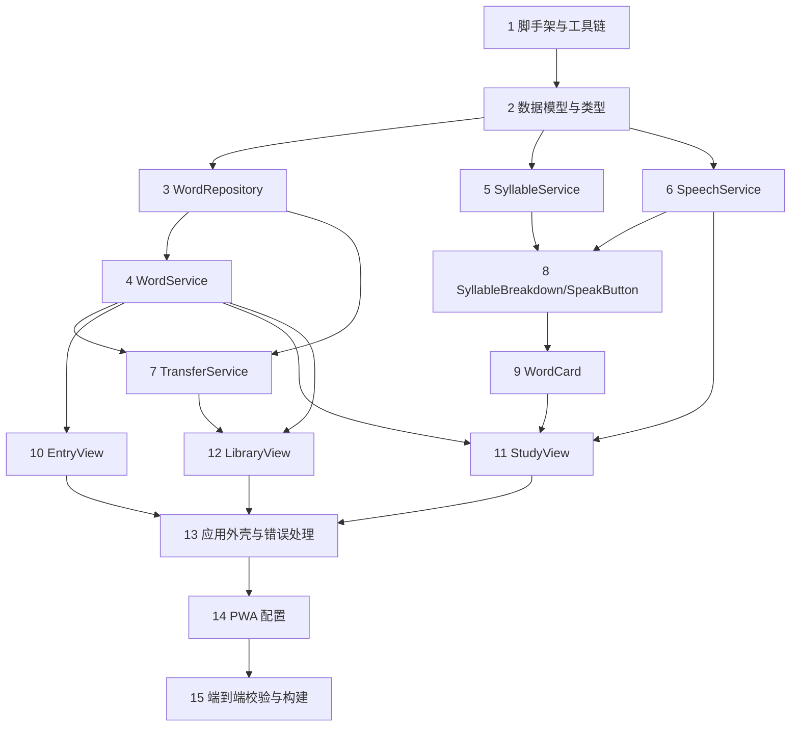

# Implementation Plan

（实现计划：english-learning-app）

## Overview

技术栈：Vite + TypeScript + 轻量框架（默认 Svelte，可替换为 Vue/React）。测试：Vitest + fast-check（PBT）+ fake-indexeddb。所有任务均为增量式编码，每步都先实现再测试，最终产出可离线运行、电脑与手机通用的 PWA。

## Tasks

- [x] 1. 初始化项目脚手架与工具链
  - 使用 Vite 创建 TypeScript 单页应用项目（默认 Svelte 模板）
  - 配置 Vitest 测试运行器，安装 fast-check 与 fake-indexeddb 开发依赖
  - 建立目录结构：src/services、src/components、src/types、tests
  - 确保 `npm run build` 与 `npm test` 可正常运行（空测试占位）
  - _Requirements: 6.1, 6.4_

- [x] 2. 定义核心数据模型与类型
  - 在 src/types 中定义 `SyllableUnit`、`Word`、`LibraryExport`、`MergeStrategy`、`ImportResult`、`StudyViewState` 等 TypeScript 接口
  - 实现 `normalizeSpelling(spelling)` 工具函数（trim + toLowerCase）
  - 实现 `validateWord(word)` 校验函数（拼写非空、createdAt<=updatedAt、syllables 单元 text 非空、colorGroup>=0）
  - 为 `normalizeSpelling` 与 `validateWord` 编写单元测试
  - _Requirements: 1.1, 1.2_

- [x] 3. 实现 WordRepository（IndexedDB 持久化封装）
  - 实现 open（含 onupgradeneeded：创建 words 仓库、唯一索引 by_normalizedSpelling、索引 by_updatedAt）
  - 实现 get、getByNormalizedSpelling、getAll、put、bulkUpsert、delete、count
  - 提供 IndexedDB 不可用时降级为内存存储的实现
  - 使用 fake-indexeddb 编写 CRUD 与唯一索引约束的单元测试
  - _Requirements: 1.1, 6.3, 6.4_

- [x] 4. 实现 WordService（单词业务逻辑）
  - 实现 addWord（trim 校验、规范化、查重抛 DuplicateWordError、createdAt==updatedAt、写入 repo）
  - 实现 updateWord、deleteWord、getWord、listWords（按 createdAt 排序）
  - 编写单元测试覆盖录入校验、查重、更新、删除
  - 编写基于属性的测试（PBT）：
    - Property 7（录入校验：空白拼写必拒绝；成功录入 createdAt==updatedAt）
    - Property 3（规范化拼写唯一：随机批量录入大小写/空格变体后全库 normalizedSpelling 唯一）
    - Property 8（ID 稳定性：同一拼写忽略大小写与首尾空格派生相同 id）
  - _Requirements: 1.1, 1.2, 1.3, 1.5_

- [x] 5. 实现 SyllableService（按读音拆分与配色）
  - 实现 split（优先用 word.syllables；为空时返回整词单元，不报错）
  - 实现 assignColorGroups（colorGroup = i % palette_size，保证相邻不同色）与 colorOf（调色板循环取色）
  - 编写单元测试
  - 编写 PBT：
    - Property 6（相邻配色相异：任意相邻单元 colorGroup 不相等）
    - Property 5（音节拼接还原：各单元 text 顺序拼接等于原拼写）
  - _Requirements: 2.1, 2.2, 2.3, 2.4_

- [x] 6. 实现 SpeechService（发音 / TTS）
  - 实现 isSupported（检测 window.speechSynthesis）
  - 实现 speak（取消上一条、创建 SpeechSynthesisUtterance、优先选英语语音、rate≈0.9、监听 voiceschanged 处理异步语音加载）
  - 实现 cancel
  - 编写单元测试（mock speechSynthesis：支持/不支持、连续调用先取消）
  - _Requirements: 3.1, 3.2, 3.3, 3.4_

- [x] 7. 实现 TransferService（词库导入 / 导出）
  - 实现 exportLibrary（组装 LibraryExport、生成 Blob、触发下载、文件名带日期）
  - 实现 importLibrary（解析+校验 app/schemaVersion、逐条 validateWord、按 MergeStrategy 合并去重、bulkUpsert、返回 ImportResult）
  - 实现 resolveConflict（keepNewer/keepLocal/keepImported）
  - 编写单元测试覆盖：导出结构、解析失败、版本不符、单条失败计数、三种合并策略
  - 编写 PBT：
    - Property 1（导出-导入往返等价）
    - Property 2（导入幂等：连续导入两次第二次 added==0）
    - Property 4（keepNewer 合并单调性：保留 updatedAt 较大者）
  - _Requirements: 4.1, 4.2, 4.3, 4.4, 4.5, 4.6_

- [x] 8. 实现展示组件 SyllableBreakdown 与 SpeakButton
  - SyllableBreakdown：接收 units，按 colorGroup 着色渲染，单元间用分隔符 `·`，始终显示
  - SpeakButton：接收 enabled 与 onClick；enabled 为 false 时置灰并显示不支持提示
  - 编写组件单元测试（着色分组、分隔符、禁用态）
  - _Requirements: 2.1, 2.2, 2.4, 3.3_

- [x] 9. 实现 WordCard（学习卡片纵向布局）
  - 按从上到下固定顺序渲染：① 单词（点击触发 onSpeak）② SyllableBreakdown ③ 音标 ④ 谐音 ⑤ 翻译
  - 空字段以占位符 `—` 显示，不破坏布局
  - 编写组件单元测试（五区块顺序、空字段占位、点击单词回调）
  - _Requirements: 5.1, 5.2, 5.3, 3.1_

- [x] 10. 实现 EntryView（单词录入页）
  - 录入表单（拼写、音标、翻译、谐音、可选音节拆分），调用 WordService.addWord
  - 成功后清空表单并提示；空拼写与重复拼写给出对应提示与"改为更新"选项
  - 编写交互测试
  - _Requirements: 1.1, 1.2, 1.3, 1.4_

- [x] 11. 实现 StudyView（学习页与导航）
  - 维护 StudyViewState（currentIndex），从 WordService.listWords 加载词库
  - 渲染当前 WordCard，提供上一词/下一词导航并重新渲染
  - 接线 WordCard.onSpeak 到 SpeechService.speak
  - 编写交互测试（导航切换、发音调用）
  - _Requirements: 5.1, 5.4, 3.1_

- [x] 12. 实现 LibraryView（词库管理与导入导出）
  - 列表展示全部单词，支持删除
  - 导出按钮调用 TransferService.exportLibrary
  - 文件选择导入调用 TransferService.importLibrary，并显示 ImportResult（新增/更新/跳过/失败）
  - 编写交互测试
  - _Requirements: 4.1, 4.2, 4.6_

- [x] 13. 应用外壳、路由与全局错误处理
  - 实现三页导航（录入/学习/词库），自适应桌面与移动端布局
  - 启动时检测 IndexedDB 与 TTS 可用性并做降级提示
  - 统一错误提示（解析失败、版本不符、重复拼写等）
  - _Requirements: 6.1, 1.3, 3.3, 4.4_

- [x] 14. 配置 PWA（可安装 + 离线）
  - 添加 Web App Manifest（name、short_name、start_url、display=standalone、icons 192/512、theme_color、background_color）
  - 添加 Service Worker：install 预缓存应用外壳，fetch 静态资源走 Cache-First
  - 注册 Service Worker，验证离线可打开
  - _Requirements: 6.2, 6.3, 6.4_

- [x] 15. 端到端校验与构建产物
  - 运行全部单元测试与 PBT，确保通过
  - 运行 `npm run build` 产出可部署的静态文件
  - 准备少量示例单词数据便于手动验证纵向布局、发音、导入导出
  - _Requirements: 6.1, 6.4_

## Task Dependency Graph



### Waves（并行调度定义）

```json
{
  "waves": [
    { "wave": 1, "tasks": ["1"] },
    { "wave": 2, "tasks": ["2"] },
    { "wave": 3, "tasks": ["3", "5", "6"] },
    { "wave": 4, "tasks": ["4", "8"] },
    { "wave": 5, "tasks": ["7", "9", "10"] },
    { "wave": 6, "tasks": ["11", "12"] },
    { "wave": 7, "tasks": ["13"] },
    { "wave": 8, "tasks": ["14"] },
    { "wave": 9, "tasks": ["15"] }
  ]
}
```

## Notes

- 每个编码任务遵循"先实现、再测试"，属性测试（PBT）对应设计文档中的 Correctness Properties，使用 fast-check 实现。
- 任务按依赖图顺序执行：模型/仓储/服务层先行，UI 组件随后，最后 PWA 与端到端校验。
- 全程无后端，数据存于 IndexedDB，跨设备迁移依赖 JSON 文件导入导出。
- 若文件读写在执行中被中断，参照 batched-file-io skill 分批读写。
